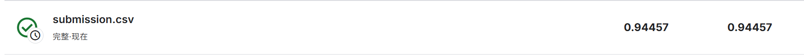

# 机器学习实验：基于 Word2Vec 的情感预测

## 1. 学生信息
- **姓名**：徐皓宁
- **学号**：112304260133
- **班级**：数据1231

> 注意：姓名和学号必须填写，否则本次实验提交无效。

---

## 2. 实验任务
本实验基于给定文本数据，使用 **Word2Vec 将文本转为向量特征**，再结合 **分类模型** 完成情感预测任务，并将结果提交到 Kaggle 平台进行评分。

本实验重点包括：
- 文本预处理
- Word2Vec 词向量训练或加载
- 句子向量表示
- 分类模型训练
- Kaggle 结果提交与分析

---

## 3. 比赛与提交信息
- **比赛名称**：IMDB 电影评论情感分析
- **比赛链接**： https://www.kaggle.com/competitions/word2vec-nlp-tutorial/overview
- **提交日期**：2026-04-15

- **GitHub 仓库地址**：https://github.com/sijipingan19/112304260133xuhaoning
- **GitHub README 地址**：

> 注意：GitHub 仓库首页或 README 页面中，必须能看到“姓名 + 学号”，否则无效。

---

## 4. Kaggle 成绩
请填写你最终提交到 Kaggle 的结果：

- **Public Score**：0.94457
- **Private Score**（如有）：0.94457
- **排名**（如能看到可填写）：

---

## 5. Kaggle 截图
请在下方插入 Kaggle 提交结果截图，要求能清楚看到分数信息。


> 建议将截图保存在 `images` 文件夹中。  
> 截图文件名示例：`2023123456_张三_kaggle_score.png`

---

## 6. 实验方法说明

### （1）文本预处理
请说明你对文本做了哪些处理，例如：
- 分词
- 去停用词
- 去除标点或特殊符号
- 转小写

**我的做法：**  
1. 移除HTML标签
2. 移除标点符号和数字
3. 转为小写
4. 使用NLTK进行分词
5. 移除英文停用词

---

### （2）Word2Vec 特征表示
请说明你如何使用 Word2Vec，例如：
- 是自己训练 Word2Vec，还是使用已有模型
- 词向量维度是多少
- 句子向量如何得到（平均、加权平均、池化等）

**我的做法：**  
1. 自己训练Word2Vec模型
2. 词向量维度：300
3. 窗口大小：10
4. 最小词频：3
5. 句子向量表示：计算词向量的平均值

---

### （3）分类模型
请说明你使用了什么分类模型，例如：
- Logistic Regression
- Random Forest
- SVM
- XGBoost

并说明最终采用了哪一个模型。

**我的做法：**  
使用 Logistic Regression 模型，参数设置为：
- max_iter：1000
- C：10.0
- random_state：42

---

## 7. 实验流程
请简要说明你的实验流程。

示例：
1. 读取训练集和测试集  
2. 对文本进行预处理  
3. 训练或加载 Word2Vec 模型  
4. 将每条文本表示为句向量  
5. 用训练集训练分类器  
6. 在测试集上预测结果  
7. 生成 submission 文件并提交 Kaggle  

**我的实验流程：**  
1. 读取带标签的训练数据和测试数据
2. 对训练数据和测试数据进行文本预处理
3. 合并所有评论数据，训练Word2Vec模型
4. 保存训练好的Word2Vec模型
5. 对每条评论计算均值词向量作为文档表示
6. 划分训练集和验证集
7. 训练逻辑回归模型
8. 在验证集上评估模型性能（AUC=0.9437）
9. 保存训练好的逻辑回归模型
10. 对测试数据进行预测
11. 生成格式正确的submission文件

---

## 8. 文件说明
请说明仓库中各文件或文件夹的作用。

示例：
- `data/`：存放数据文件
- `src/`：存放源代码
- `notebooks/`：存放实验 notebook
- `images/`：存放 README 中使用的图片
- `submission/`：存放提交文件

**我的项目结构：**
```text
project/
├─ data/
├─ src/
├─ notebooks/
├─ images/
├─ submission/
└─ README.md
```
