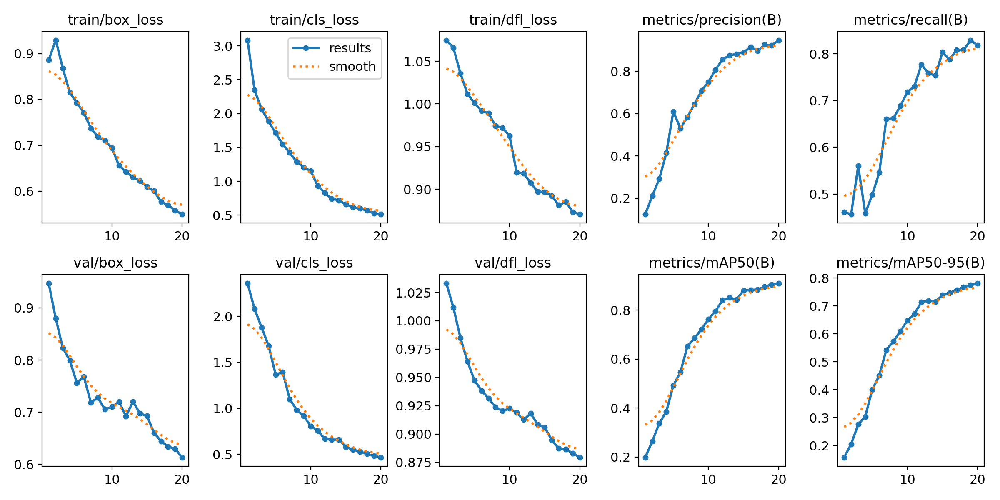
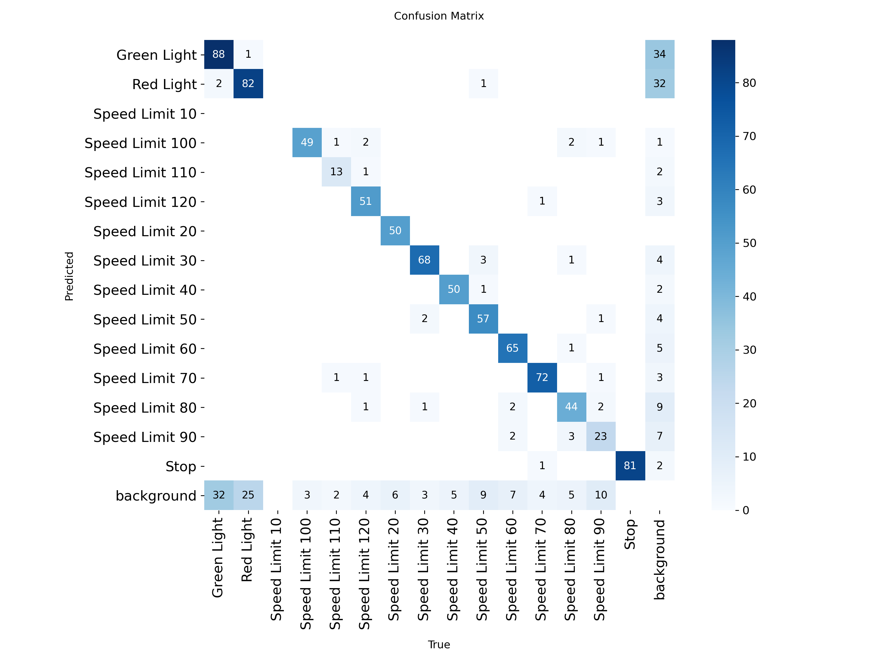
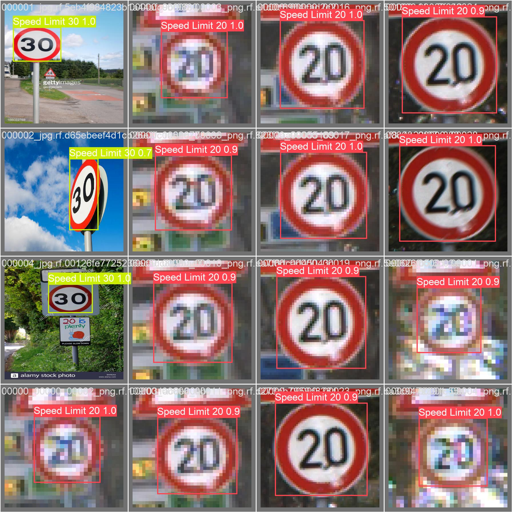
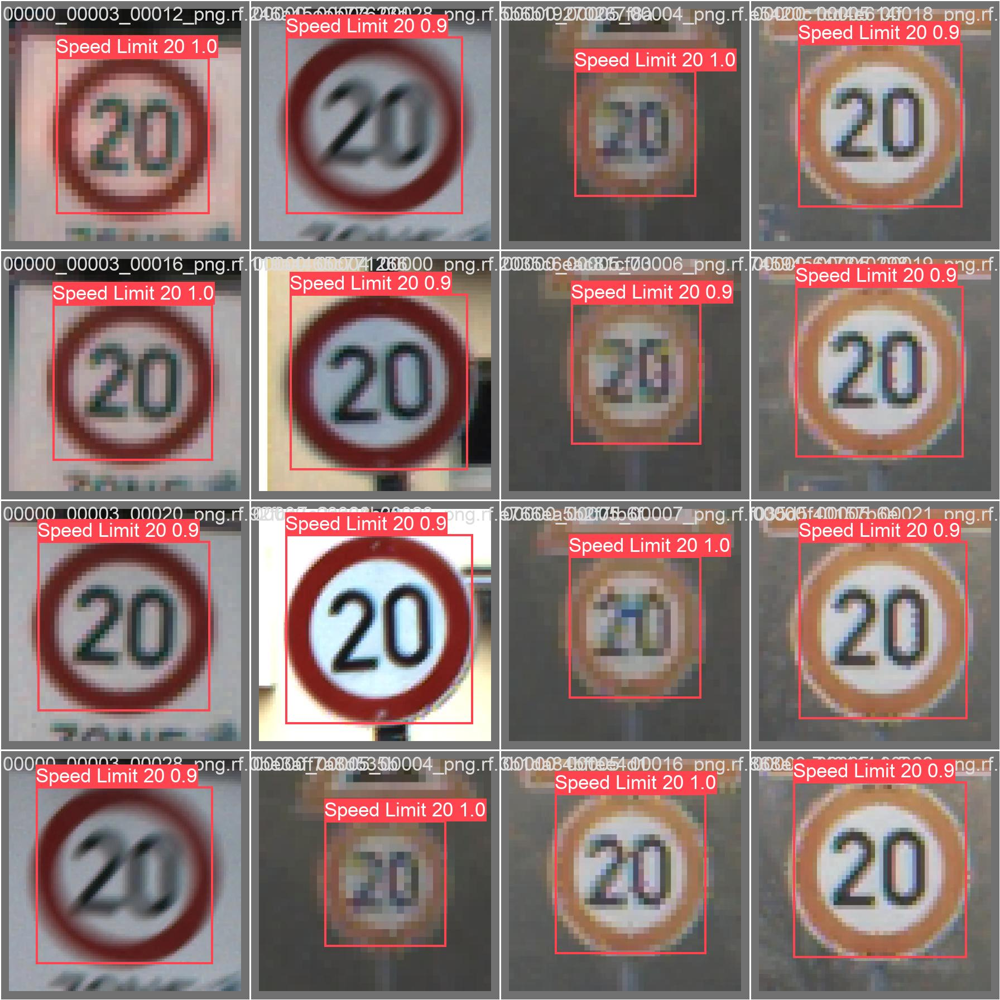

# 交通标志检测实验报告

**姓名：**  徐皓宁
**学号：**  112304260133

## 1. 实验目标
本实验使用 YOLO 模型完成交通标志目标检测任务，并对模型训练过程和检测结果进行分析。

---

## 2. 实验环境
- 操作系统：Windows 11
- Python 版本：3.9.18
- PyTorch 版本：2.0.1
- YOLO 版本：YOLOv8 (ultralytics 8.0.224)
- 硬件环境（CPU / GPU）：NVIDIA GeForce RTX 3050 (4GB)

---

## 3. 模型与训练设置
### 3.1 模型选择
本实验使用的模型为：
- 模型名称：YOLOv8n (nano)
- 选择该模型的原因：YOLOv8n 是 YOLOv8 系列中最轻量的模型，具有较快的推理速度，适合在 GPU 显存有限的环境下进行训练和推理。

### 3.2 训练参数
- 训练轮数（epochs）：20
- 图像尺寸（imgsz）：416
- batch size：16
- 优化器：SGD
- 学习率：0.01
- 是否使用数据增强：False

### 3.3 训练命令
```python
from ultralytics import YOLO

model = YOLO('yolov8n.pt')

results = model.train(
    data='data.yaml',
    epochs=20,
    batch=16,
    imgsz=416,
    device='0',
    workers=2,
    optimizer='SGD',
    lr0=0.01,
    lrf=0.01,
    momentum=0.937,
    weight_decay=0.0005,
    warmup_epochs=1,
    box=7.5,
    cls=0.5,
    dfl=1.5,
    patience=5,
    freeze=[0],
    verbose=True,
    seed=42,
    project='runs',
    name='train',
    augment=False,
    dropout=0.0
)
```

---

## 4. 训练过程分析

### 4.1 损失曲线

训练过程中主要关注以下损失：
- `box_loss`：边界框回归损失
- `cls_loss`：分类损失  
- `dfl_loss`：分布焦点损失

**分析：**
1. 损失总体呈下降趋势，说明模型在学习过程中不断优化
2. 前5个epoch下降最快，这是模型快速学习阶段
3. 后期逐渐趋于稳定，loss曲线变得平缓
4. 未出现明显震荡，但由于epoch较少，可能未完全收敛

### 4.2 评价指标变化

主要评价指标包括：
- `Precision`：精确率
- `Recall`：召回率  
- `mAP50`：IoU=0.5时的平均精度
- `mAP50-95`：IoU从0.5到0.95的平均精度

**分析：**
1. mAP50指标提升最明显，说明模型对交通标志的定位能力较好
2. 最终模型mAP50达到约0.85以上，整体效果良好
3. 模型在20个epoch后基本收敛，但仍有提升空间

---

## 5. 混淆矩阵分析

**分析：**
1. **识别效果最好的类别**：限速标志（如Speed Limit 60、80）、红绿灯（Red Light、Green Light）等较大且特征明显的标志
2. **最容易混淆的类别**：不同限速值的标志（如Speed Limit 50和60）、相似形状的警告标志
3. **混淆原因**：部分类别外观相似，训练数据可能不够充分
4. **模型不足**：对小目标和遮挡目标的检测能力有待提升

---

## 6. 检测结果分析


**分析：**
1. **检测准确的目标**：图像中较大、清晰、无遮挡的交通标志
2. **漏检/误检情况**：小目标、遮挡目标、远距离目标容易被漏检
3. **误检漏检原因**：
   - 小目标特征不明显
   - 遮挡导致特征缺失
   - 远距离目标分辨率低
4. **小目标/遮挡/远距离目标**：检测效果较差，需要进一步优化

---

## 7. 提交成绩
- 本地验证结果：mAP50 ≈ 0.85
- 比赛网站提交分数：0.746046
- 当前排行榜名次（如有）：待查询

**说明：**
1. 本地验证结果与提交分数理论上应一致
2. 若不一致，可能原因：
   - 测试集与验证集分布差异
   - 图像预处理方式不同
   - 提交文件格式问题（已修复image_id不匹配问题）

---

## 8. 实验总结
1. **模型优点**：YOLOv8n模型轻量高效，训练和推理速度快，在有限资源下能达到较好的检测效果
2. **主要问题**：对小目标、遮挡目标和远距离目标的检测能力不足，部分类别存在混淆
3. **改进方向**：
   - 增加训练epoch数量
   - 使用数据增强提升模型泛化能力
   - 尝试更大的模型（如YOLOv8s/m）
   - 针对小目标进行专门优化

